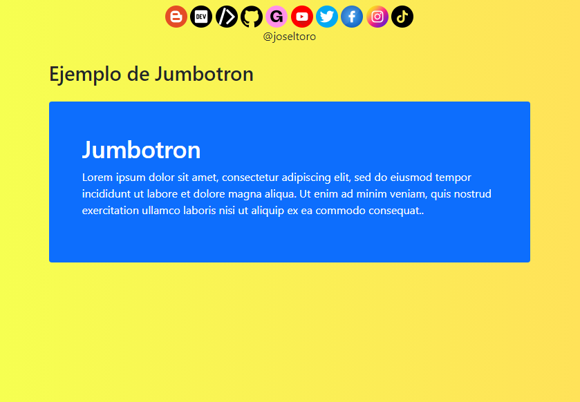

# Bootstrap 5 | Jumbotron

📒 Se introdujo un jumbotron en Bootstrap 3 como una gran caja acolchada para llamar la atención adicional sobre algún contenido o información especial.

📒 Los jumbotrons ya no son compatibles con Bootstrap 5. Sin embargo, puede usar un elemento <code>div</code> y agregar clases auxiliares especiales junto con una clase de color para lograr el mismo efecto:

    

    <h1>Jumbotron Example</h1>
    
Lorem ipsum...

    

Redes sociales:

- https://instagram.com/dev.joseltoro
- https://facebook.com/devjoseltoro
- https://tiktok.com/@dev.joseltoro
- https://dev.to/joseltoro
- https://code.dcoder.tech/profile/joseltoro
- https://joseltoro.blogspot.com/
- https://joseltoro.gumroad.com/